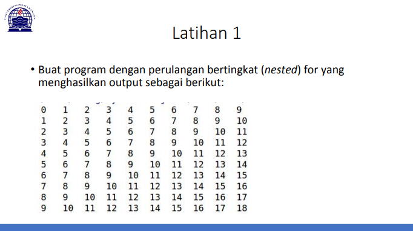

# Pertemuan 7_lab3
Repository ini dibuat untuk memenuhi tugas bahasa pemrograman pertemuan 7-lab3

***Nama : Miftahu Rizkiyah***

***NIM  : 312010014***

***Kelas: TI.20.B.1***

## Tugas Praktikum Lab 3

Pada Repository ini saya mendapatkan tugas dari Dosen bahasa Pemrograman pada latihan 1 dan latihan 2 pada pertemuan ke-7.
<br>
***check this out***

<br>

* **Latihan 1**

Pada latihan 1 saya akan membuat program dengan perulangan bertingkat ***(nested)*** for : <br>


Berikut source code yang saya buat dalam program latihan 1 atau pada link berikut [link_latihan1](lab3_latihan1.py)
<br>
``` python
print(list(range(0, 10, 1)))
print(list(range(1, 11, 1)))
print(list(range(2, 12, 1)))
print(list(range(3, 13, 1)))
print(list(range(4, 14, 1)))
print(list(range(5, 15, 1)))
print(list(range(6, 16, 1)))
print(list(range(7, 17, 1)))
print(list(range(8, 18, 1)))
print(list(range(9, 19, 1)))
```

* Ket : <br>
Perulangan ***for*** disebut juga sebagai counted loop (perulangan yang terhitung), yaitu perintah yang dieksekusi secara berulang berdasarkan jumlah perulangan tertentu.<br>
**(Nested loop)** atau pengulangan bersarang dimana for yang juga berada didalam pernyataan (Perulangan didalam perulangan)

Pada source code tersebut akan menghasilkan output :<br>

<br>
<br>


* **Latihan2**

Pada latihan 2 saya akan membuat program tampilan ***n*** bilangan acak yang lebih kecil dari 0.5. <br>

<br>

Pada tugas tersebut saya menggunakan kombinasi ***(import random dan uniform)***, dengan source code sebagai berikut atau pada link [link_latihan2](lab3_latihan2.py) : <br>
``` python
n=int(input("Masukan Jumlah Nilai N : "))
print("\n")

import random

for a in list(range(1,n+1,1)):
    print(random.uniform(0,0.5))

print()
```

Pada source code tersebut akan menghasilkan output sebagai berikut : <br>

<br>

* Ket : <br>
fungsi random() akan menghasilkan angka yang memiliki tipe data float dan berada pada rentang 0,0 hingga 1,0. Pada fungsi ini tidak perlu menambahkan argument. <br>
uniform sendiri berfungsi untuk menampilkan bilangan float random dengan batas awal bilangan dan batas akhir.

<br>
Demikian repository dari saya, semoga bisa bermanfaat dan memnuhi tugas saya sendiri khusunya.


<br>
<br>

### ***===== Miftahu Rizkiyah =====***
### ***=====    312010014  =====***
### ***===== TI.20.B.1    =====***


